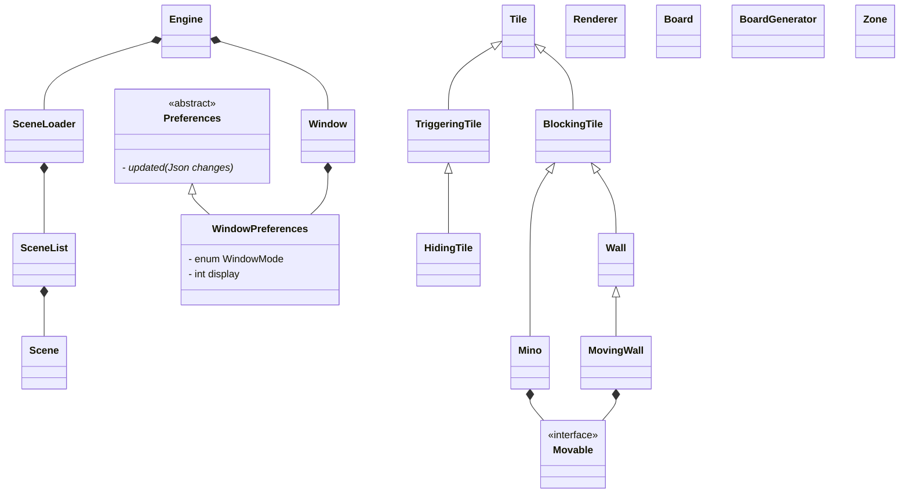

```mermaid
classDiagram
    class Tile
    class Engine
    class Renderer
    class Board
    class BoardGenerator
    class Zone
    class Scene
    class SceneLoader
    class Preferences {
        <<abstract>>
        - updated(Json changes)*
    }

    class WindowPreferences{
        - enum WindowMode
        - int display
    }
    class Window

    class Movable {
        <<interface>>
    }

    %% On trigger : 
    class HidingTile

    %% Other tiles can pass through this tile, but something happens upon doing so
    class TriggeringTile
    
    %% Other tiles cannot pass through this tile
    class BlockingTile
    
    class Wall
    class MovingWall
    class Mino
    
    Engine *-- SceneLoader
    Engine *-- Window

    Window *-- WindowPreferences

    SceneLoader *-- SceneList
    SceneList *-- Scene

    Tile <|-- TriggeringTile
    Tile <|-- BlockingTile

    TriggeringTile <|-- HidingTile

    BlockingTile <|-- Mino
    BlockingTile <|-- Wall

    Wall <|-- MovingWall

    Preferences <|-- WindowPreferences

    MovingWall *-- Movable

    Mino *-- Movable
```