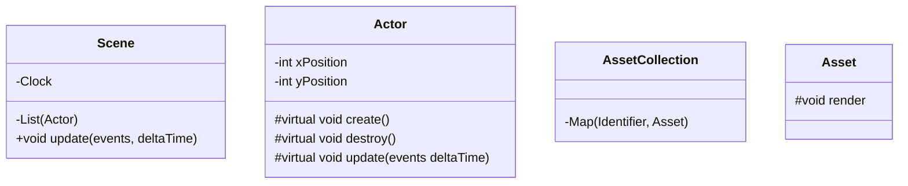

```mermaid
classDiagram
    class Scene {
        -Clock
        -List(Actor)
        +void update(events, deltaTime)
    }

    class Actor {
        -int xPosition
        -int yPosition
        #virtual void create()
        #virtual void destroy()
        #virtual void update(events deltaTime)
    }

    class AssetCollection {
        -Map(Identifier, Asset)
    }

    class Asset {
        #void render
    }
```
- AssetCollection
  - Actors load assets by identifier from here
- Need to pass in event from the engine