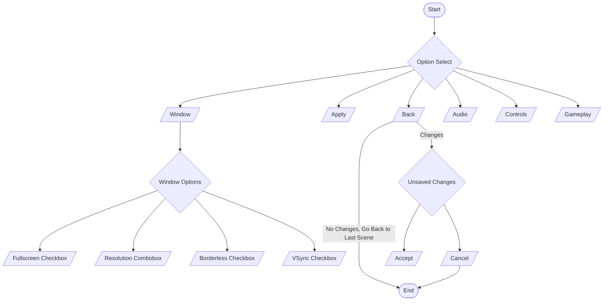

> A text menu on one side and on the other a menu that changes depending on what option is selected in the other menu.

- Parameters
  - previousScene

```mermaid
graph TD
    %% Nodes
        start([Start])
        finish([End])
        decisionSelectOptions{Option Select}
        decisionUnsavedChanges{Unsaved Changes}
        decisionWindow{Window Options}
        optionUnsavedAccept[/Accept/]
        optionUnsavedCancel[/Cancel/]
        optionWindow[/Window/]
        optionAudio[/Audio/]
        optionControls[/Controls/]
        optionGameplay[/Gameplay/]
        optionApply[/Apply/]
        optionBack[/Back/]
        checkboxFullscreen[/Fullscreen Checkbox/]
        checkboxBorderless[/Borderless Checkbox/]
        checkboxVSync[/VSync Checkbox/]
        comboBoxResolution[/Resolution Combobox/]
    %% Links
        start --> decisionSelectOptions

        decisionSelectOptions --> optionWindow
        decisionSelectOptions --> optionApply
        decisionSelectOptions --> optionBack
        decisionSelectOptions --> optionAudio
        decisionSelectOptions --> optionControls
        decisionSelectOptions --> optionGameplay

        optionWindow --> decisionWindow

        optionBack -- No Changes, Go Back to Last Scene --> finish
        optionBack -- Changes --> decisionUnsavedChanges

        decisionUnsavedChanges --> optionUnsavedAccept
        decisionUnsavedChanges --> optionUnsavedCancel --> finish

        decisionWindow --> checkboxFullscreen
        decisionWindow --> comboBoxResolution
        decisionWindow --> checkboxBorderless
        decisionWindow --> checkboxVSync

        %%comboBoxResolution --> 
```