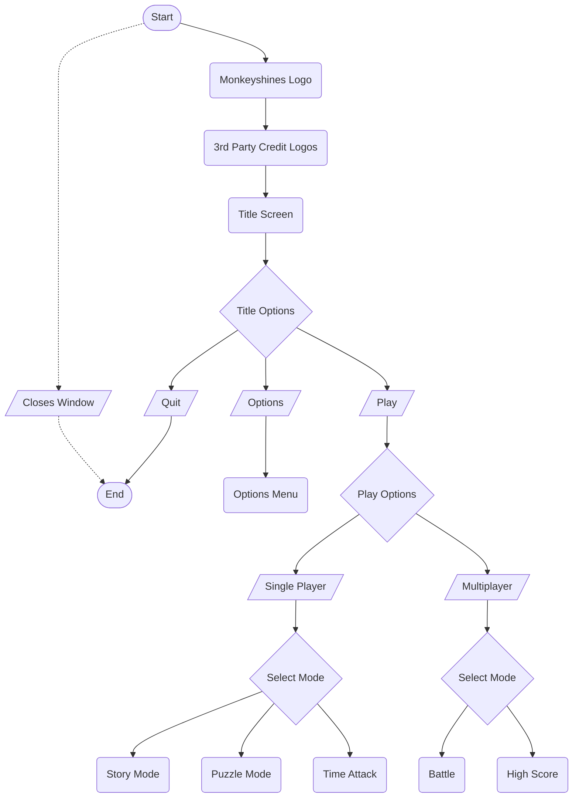

```mermaid
graph TB
    %% Nodes
        start([Start])
        finish([End])
        %% TimedStaticScene
            logo(Monkeyshines Logo)
            credits(3rd Party Credit Logos)
        title(Title Screen)
        optionsMenu(Options Menu)
        modeSinglePlayer[/Single Player/]
        submodeStory(Story Mode)
        submodePuzzle(Puzzle Mode)
        submodeTimeAttack(Time Attack)
        optionMultiPlayer[/Multiplayer/]
        optionPlay[/Play/]
        optionOptions[/Options/]
        optionQuit[/Quit/]
        submodeBattle(Battle)
        submodeHighScore(High Score)
        decisionTitleOptions{Title Options}
        decisionModeSelect{Play Options}
        decisionSinglePlayerModeSelect{Select Mode}
        decisionMultiPlayerModeSelect{Select Mode}

    %% Links
        start --> logo
        start -.-> q[/Closes Window/] -.-> finish

        logo --> credits

        credits --> title

        title --> decisionTitleOptions

        decisionTitleOptions --> optionPlay --> decisionModeSelect
        decisionTitleOptions --> optionOptions --> optionsMenu
        decisionTitleOptions --> optionQuit --> finish

        decisionModeSelect --> modeSinglePlayer --> decisionSinglePlayerModeSelect
        decisionModeSelect --> optionMultiPlayer

        decisionSinglePlayerModeSelect --> submodeStory
        decisionSinglePlayerModeSelect --> submodePuzzle
        decisionSinglePlayerModeSelect --> submodeTimeAttack

        decisionMultiPlayerModeSelect --> submodeBattle
        decisionMultiPlayerModeSelect --> submodeHighScore
        
        optionMultiPlayer --> decisionMultiPlayerModeSelect
```