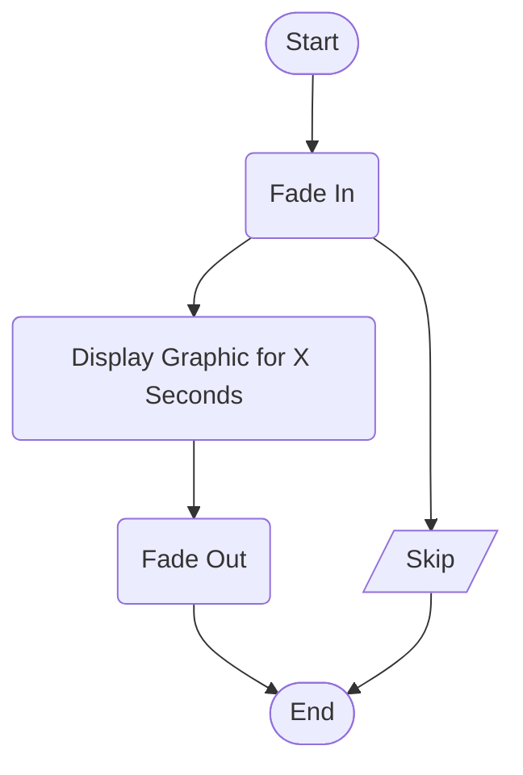

> Scene depicts a static graphic or group of graphics that fade into view, remain for a specified duration and then fade out of view

- Parameters
  - duration
  - fadeInSpeed
  - fadeOutSpeed
  - graphics

