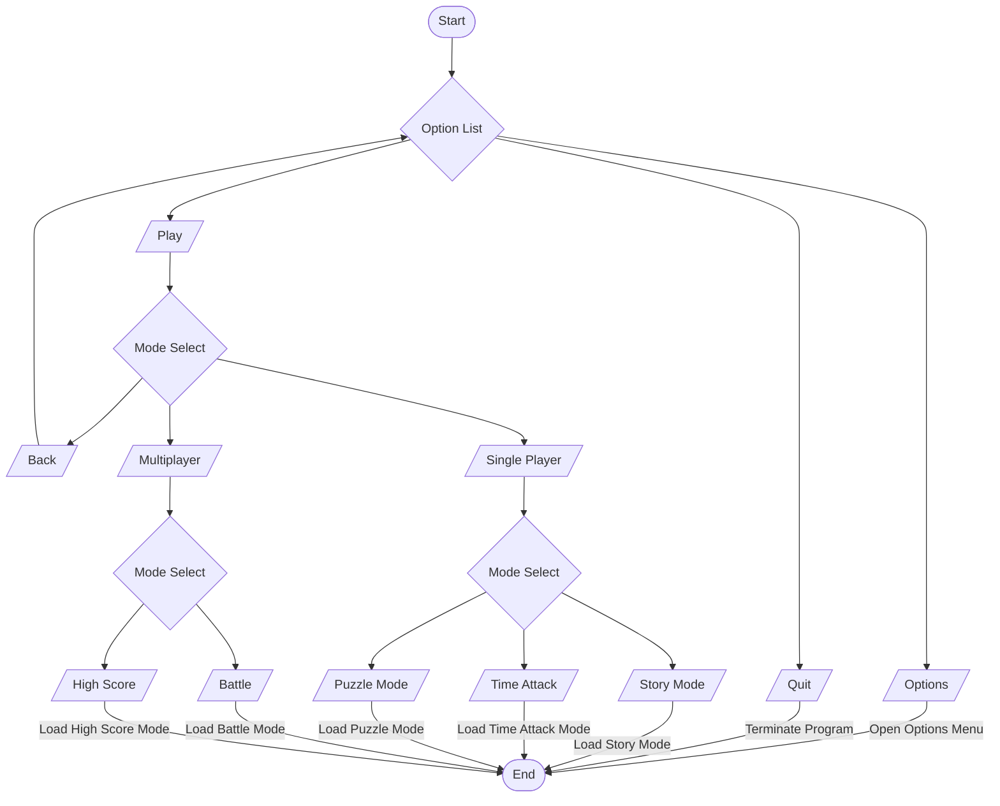

> Scene shows title word art above a centered text menu. Background should be a static image of Dominoland.

```mermaid
graph TD
    %% Nodes
        start([Start])
        finish([End])
        decisionTitleOptions{Option List}
        decisionModeSelect{Mode Select}
        decisionSinglePlayerModeSelect{Mode Select}
        decisionMultiPlayerModeSelect{Mode Select}
        optionQuit[/Quit/]
        optionOptions[/Options/]
        optionPlay[/Play/]
        optionBack[/Back/]
        optionSinglePlayer[/Single Player/]
        optionMultiPlayer[/Multiplayer/]
        optionStoryMode[/Story Mode/]
        optionTimeAttack[/Time Attack/]
        optionPuzzleMode[/Puzzle Mode/]
        optionBattle[/Battle/]
        optionHighScore[/High Score/]
    %% Links
        start --> decisionTitleOptions

        decisionTitleOptions --> optionQuit
        decisionTitleOptions --> optionOptions -- Open Options Menu --> finish
        decisionTitleOptions --> optionPlay

        optionQuit -- Terminate Program --> finish

        optionPlay --> decisionModeSelect

        decisionModeSelect --> optionBack --> decisionTitleOptions
        decisionModeSelect --> optionSinglePlayer --> decisionSinglePlayerModeSelect
        decisionModeSelect --> optionMultiPlayer --> decisionMultiPlayerModeSelect

        decisionSinglePlayerModeSelect --> optionStoryMode 
            -- Load Story Mode --> finish
        decisionSinglePlayerModeSelect --> optionTimeAttack 
            -- Load Time Attack Mode --> finish
        decisionSinglePlayerModeSelect --> optionPuzzleMode 
            -- Load Puzzle Mode --> finish

        decisionMultiPlayerModeSelect --> optionBattle
            -- Load Battle Mode --> finish
        decisionMultiPlayerModeSelect --> optionHighScore
            -- Load High Score Mode --> finish
```